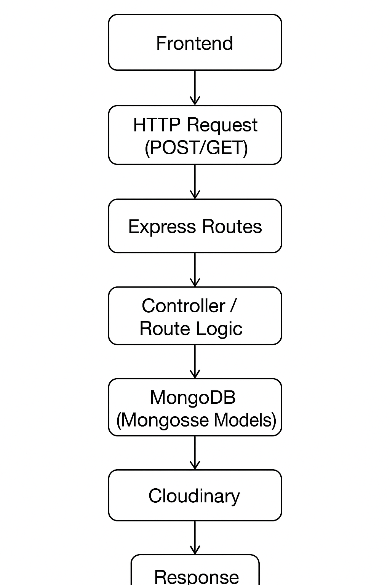
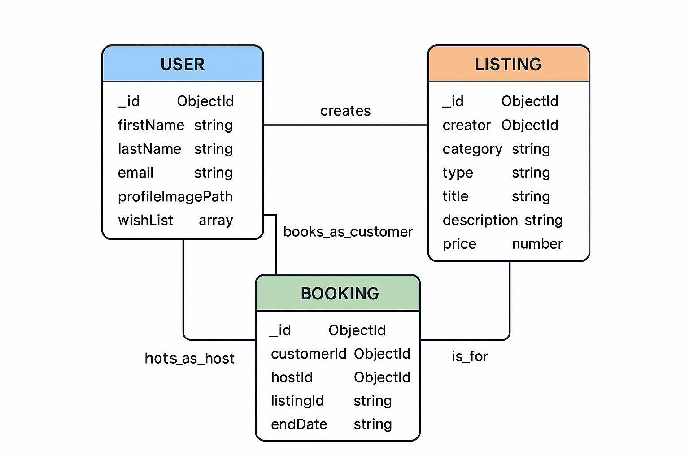

# Dream Nest - Property Booking Platform

Dream Nest is a feature-rich property booking platform that allows users to register, list properties, search for and book accommodations, manage reservations, and curate wish lists.

## 1️⃣ Overview

This repository contains the backend implementation of the Dream Nest platform.

### Tech Stack

*   **Backend:** Node.js + Express.js
*   **Database:** MongoDB + Mongoose
*   **File Storage:** Cloudinary (for images)
*   **Authentication:** JWT + Bcrypt
*   **API Testing:** Postman / Swagger (optional)

## 2️⃣ Modules & Features

### Authentication (auth)
*   User registration with profile image upload
*   User login with JWT-based authentication
*   Password hashing for security

### Users (users)
*   Get and update user profiles
*   Manage a wish list of properties
*   View a list of user-owned properties
*   Access lists of reservations and trips

### Properties / Listing (listing)
*   Create new property listings with image uploads to Cloudinary
*   Browse listings by category
*   Search for listings
*   View detailed information for each listing

### Bookings (booking)
*   Create new bookings for properties
*   View trips taken by a user
*   View reservations made for a host's properties

## 3️⃣ Database Design

### User Collection
```json
{
  "_id": "ObjectId",
  "firstName": "string",
  "lastName": "string",
  "email": "string",
  "password": "string (hashed)",
  "profileImagePath": "string (Cloudinary URL)",
  "tripList": [],
  "wishList": [],
  "propertyList": [],
  "reservationList": [],
  "createdAt": "timestamp",
  "updatedAt": "timestamp"
}
```
### Listing Collection
```json
{
  "_id": "ObjectId",
  "creator": "ObjectId (ref User)",
  "category": "string",
  "type": "string",
  "streetAddress": "string",
  "aptSuite": "string",
  "city": "string",
  "province": "string",
  "country": "string",
  "guestCount": "number",
  "bedroomCount": "number",
  "bedCount": "number",
  "bathroomCount": "number",
  "amenities": ["array"],
  "listingPhotoPaths": ["array of Cloudinary URLs"],
  "title": "string",
  "description": "string",
  "highlight": "string",
  "highlightDesc": "string",
  "price": "number",
  "createdAt": "timestamp",
  "updatedAt": "timestamp"
}
```
### Booking Collection
```json
{
  "_id": "ObjectId",
  "customerId": "ObjectId (ref User)",
  "hostId": "ObjectId (ref User)",
  "listingId": "ObjectId (ref Listing)",
  "startDate": "string",
  "endDate": "string",
  "totalPrice": "number",
  "createdAt": "timestamp",
  "updatedAt": "timestamp"
}
```
## 4️⃣ API Endpoints
# API Endpoints – Dream Nest Backend

---

## **Auth Routes**

| Endpoint           | Method | Description                                     |
|-------------------|--------|-------------------------------------------------|
| `/auth/register`   | POST   | Register a user and upload their profile image |
| `/auth/login`      | POST   | Login a user and generate a JWT               |

---

## **User Routes**

| Endpoint                                   | Method | Description                                           |
|-------------------------------------------|--------|-------------------------------------------------------|
| `/users/:userId/trips`                     | GET    | Get trips for a specific user                        |
| `/users/:userId/properties`                | GET    | Get properties created by a user                     |
| `/users/:userId/reservations`              | GET    | Get reservations for a host's properties            |
| `/users/:userId/:listingId`                | PATCH  | Add or remove a listing from a user's wish list      |

---

## **Listing Routes**

| Endpoint                        | Method | Description                                      |
|--------------------------------|--------|--------------------------------------------------|
| `/properties/create`            | POST   | Create a new property listing and upload photos |
| `/properties/`                  | GET    | Get all listings or filter by category          |
| `/properties/search/:search`    | GET    | Search for listings by title or category        |
| `/properties/:listingId`        | GET    | Get the details of a specific listing           |

---

## **Booking Routes**

| Endpoint               | Method | Description                   |
|------------------------|--------|-------------------------------|
| `/bookings/create`      | POST   | Create a new booking          |

## 5️⃣ File & Folder Structure
code
Code
```json{
backend/
│
├── routes/
│   ├── auth.js
│   ├── listing.js
│   ├── booking.js
│   └── user.js
│
├── controllers/
│   ├── authController.js
│   ├── listingController.js
│   ├── bookingController.js
│   └── userController.js
│
├── models/
│   ├── User.js
│   ├── Listing.js
│   └── Booking.js
│
├── utils/
│   └── cloudinary.js
│
├── middlewares/
│   └── authMiddleware.js
│
├── public/uploads/
├── .env
├── server.js
└── package.json
}
```
## 6️⃣ Cloudinary Integration


This project uses **Cloudinary** for storing user and listing images. The workflow is as follows:

1. **Temporary Storage:**  
   Uploaded images are first stored temporarily in the `public/uploads` directory.

2. **Upload to Cloudinary:**  
   Images are then uploaded to Cloudinary using the Cloudinary SDK.

3. **Save URL in Database:**  
   After a successful upload, the **Cloudinary URL** of each image is saved in the corresponding MongoDB document:
   - User profile images → `User.profileImagePath`
   - Listing images → `Listing.listingPhotoPaths`

4. **Cleanup Local Files:**  
   Local files in `public/uploads` are deleted after a successful Cloudinary upload to save disk space.

**Benefits:**
- Offloads image storage from the server.
- Provides optimized delivery with URLs.
- Easily scalable and secure.

## 7️⃣ Flow Diagram (Description)
### User Flow – Registration, Listing, or Booking

A typical user flow for registration, listing, or booking follows this sequence:

1. **Frontend** sends an HTTP Request (POST/GET).  
2. **Express Routes** receives the request and calls the appropriate controller.  
3. **Controller / Route Logic** handles the business logic and performs CRUD operations.  
4. **MongoDB (Mongoose Models)** interacts with the database.  
5. **Cloudinary** is utilized for image uploads (if applicable).  
6. A **Response** is sent back to the Frontend.  


## 8️⃣ Authentication Flow
1. A user sends a POST request to `/auth/register` with their profile information and an image.
2. The backend uploads the image to Cloudinary and saves the returned URL in the new `User` collection entry.
3. The user's password is an encrypted hash using `bcrypt`.
4. The new user document is saved in MongoDB.
5. Upon login, the backend verifies the user's password and generates a JWT, which is then sent back to the frontend for session management.
## 9️⃣ Notes for GitHub
1. A **User** can create many **Listings**.
2. A **User** (as a customer) can create many **Bookings**.
3. A **User** (as a host) can be associated with many **Bookings**.
4. A **Listing** can be part of many **Bookings**.

  ### ER Diagram



## Environment Variables
Create a .env.example file with the following environment variables:
```
PORT=3001
MONGO_URL=<MongoDB_URI>
JWT_SECRET=<your_jwt_secret>
CLOUDINARY_CLOUD_NAME=<cloud_name>
CLOUDINARY_API_KEY=<api_key>
CLOUDINARY_API_SECRET=<api_secret>
```
